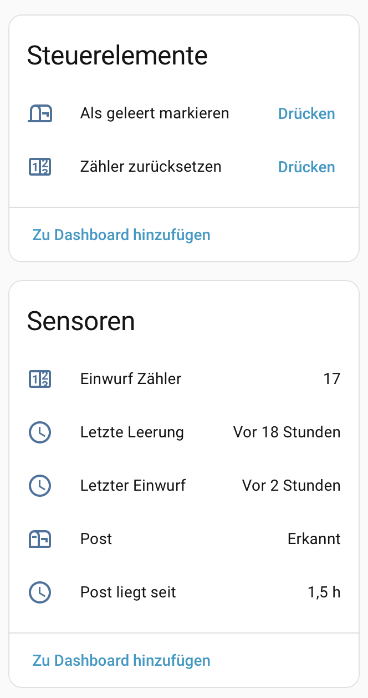

# Smart Mailbox

Home Assistant integration for smart mailboxes with flap and door sensors.

## Features

- **Mail** (binary_sensor): Indicates whether mail is present in the mailbox
- **Last Delivery** (timestamp): Time of the last mail delivery
- **Last Emptied** (timestamp): Time of the last mailbox emptying
- **Delivery Counter** (optional): Counts the number of deliveries
- **Mail Age** (optional): Shows how long mail has been in the mailbox (hours/days)
- **Debounce** for the flap sensor (configurable)
- **Push notification** on new mail (optional, only once per delivery)
- **Reset Service**: `smartmailbox.reset_counter`

## Installation

### HACS (recommended)

1. Open HACS in Home Assistant
2. Click on "Integrations"
3. Click the three dots in the top right corner → "Custom repositories"
4. Add `https://github.com/danyial/ha-smart-mailbox` (Category: Integration)
5. Search for "Smart Mailbox" and install it
6. Restart Home Assistant

### Manual

Copy the `custom_components/smartmailbox/` folder to your Home Assistant `config/custom_components/` directory and restart Home Assistant.

## Configuration

1. Go to **Settings → Devices & Services → Add Integration**
2. Search for "Smart Mailbox"
3. Select your flap and door sensors
4. Optional: Click **Configure** to adjust additional options

## Requirements

You need two binary sensors:
- **Flap sensor**: Detects the opening of the mail slot (mail delivery)
- **Door sensor**: Detects the opening of the retrieval door (mailbox emptying)
