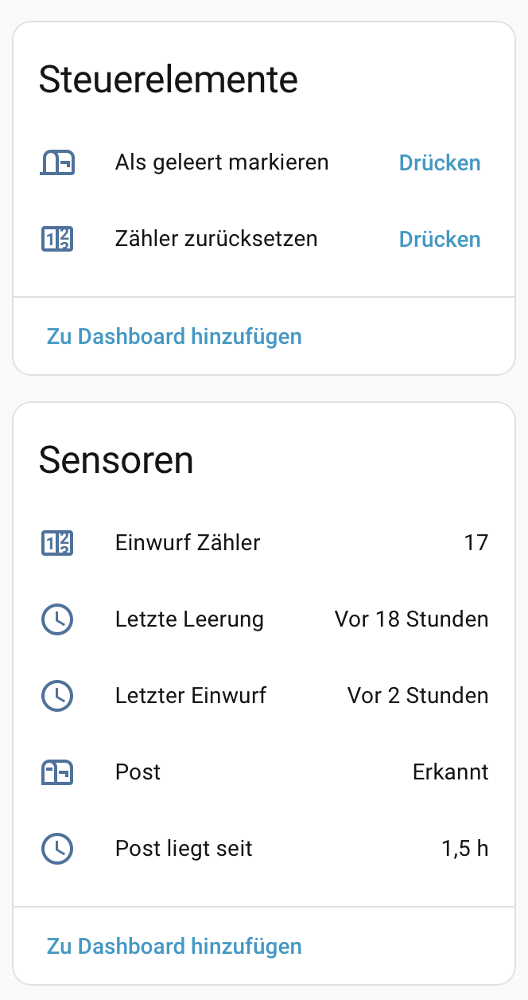

# Smart Mailbox

A Home Assistant custom integration that turns two physical sensors (mail flap + retrieval door) into a smart mailbox device. It tracks deliveries, empties, counts, mail age, and sends optional push notifications.

Supports both **binary sensors** (contact/window sensors) and **numeric sensors** (e.g. angle sensors) as triggers.

## Features

- Detects mail deliveries via flap sensor and mailbox emptying via door sensor
- Supports **binary sensors** and **numeric sensors** (e.g. angle/tilt sensors) with configurable thresholds
- Configurable **debounce** to prevent false triggers from flap bouncing
- **Push notifications** on new mail and/or mail collection (optional, only once per delivery period)
- **Delivery counter** with optional auto-reset on emptying
- **Mail age** sensor showing how long mail has been sitting (hours or days)
- **Multiple instances** — run several smart mailboxes simultaneously
- **Persistent state** — survives Home Assistant restarts
- Available in **English** and **German**
- Fully UI-configurable via Config Flow and Options Flow

## Entities

Each mailbox instance creates the following entities:

| Entity | Type | Description | Optional |
|---|---|---|---|
| Mail | `binary_sensor` | Whether mail is currently present | No |
| Last Delivery | `sensor` | Timestamp of the last mail delivery | No |
| Last Emptied | `sensor` | Timestamp of the last mailbox emptying | No |
| Delivery Counter | `sensor` | Number of accepted flap events | Yes |
| Mail Age | `sensor` | How long mail has been in the mailbox (hours/days) | Yes |
| Reset Counter | `button` | Resets the delivery counter to zero | No |
| Mark as Empty | `button` | Marks the mailbox as empty without opening the door | No |

## Installation

### HACS (recommended)

1. Open HACS in Home Assistant
2. Click on "Integrations"
3. Click the three dots in the top right corner and select "Custom repositories"
4. Add `https://github.com/danyial/ha-smart-mailbox` with category **Integration**
5. Search for "Smart Mailbox" and install it
6. Restart Home Assistant

### Manual

Copy the `custom_components/smartmailbox/` folder to your Home Assistant `config/custom_components/` directory and restart Home Assistant.

## Configuration

### Initial Setup

1. Go to **Settings > Devices & Services > Add Integration**
2. Search for **Smart Mailbox**
3. **Step 1:** Enter a name, select your flap and door sensors, set debounce time, and optionally enable notifications
4. **Step 2 (only for numeric sensors):** If you selected a non-binary sensor (e.g. an angle sensor), configure the trigger threshold and direction (above/below)

### Supported Sensor Types

| Sensor Type | Trigger Condition | Example |
|---|---|---|
| **Binary sensor** | Triggers when state changes to `on` | Window/door contact sensor |
| **Numeric sensor** | Triggers when value crosses a configurable threshold | Angle sensor, tilt sensor |

For numeric sensors, you configure:
- **Threshold** — the value that must be crossed to trigger (e.g. `30` degrees)
- **Direction** — whether to trigger when the value goes **above** or **below** the threshold

Each sensor (flap and door) can be configured independently. For example, you can use a binary contact sensor for the flap and an angle sensor for the door.

### Options

After setup, click **Configure** on the integration to adjust these options:

| Option | Default | Description |
|---|---|---|
| Debounce time | `3` seconds | Minimum time between accepted flap events |
| Enable delivery counter | `true` | Show the delivery counter sensor |
| Enable mail age | `true` | Show the mail age sensor |
| Age unit | `hours` | Display mail age in hours or days |
| Reset counter on empty | `false` | Automatically reset the counter when the mailbox is emptied |
| Enable push notifications | `false` | Send a notification on new mail delivery |
| Notification service(s) | — | One or more `notify.*` services to use |
| Notification message | — | Custom message text (defaults to a localized message) |
| Enable collection notifications | `false` | Send a notification when mail is collected |
| Collection notification service(s) | — | One or more `notify.*` services for collection |
| Collection notification message | — | Custom collection message text |

## Services & Buttons

### Services

| Service | Description | Parameters |
|---|---|---|
| `smartmailbox.reset_counter` | Resets the delivery counter to zero | `entry_id` (optional) — target a specific mailbox instance |
| `smartmailbox.mark_empty` | Marks the mailbox as empty (no mail present) | `entry_id` (optional) — target a specific mailbox instance |

When called without `entry_id`, both services apply to **all** mailbox instances.

### Buttons

- **Reset Counter** — Same as calling `smartmailbox.reset_counter`, available as a button entity for dashboards and automations
- **Mark as Empty** — Same as calling `smartmailbox.mark_empty`, useful when you collect mail without triggering the door sensor

## Multiple Instances

You can set up multiple Smart Mailbox instances for different mailboxes. Each instance has its own set of entities, state, and configuration. Services can target specific instances using the `entry_id` parameter.

## Translations

The integration is fully translated in:
- English
- German (Deutsch)

The language is automatically selected based on your Home Assistant language setting.
